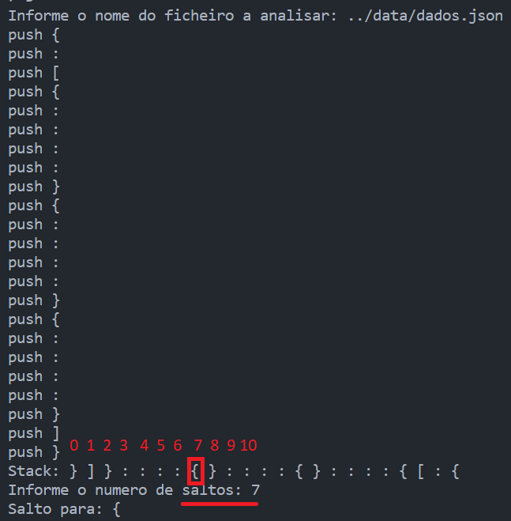

# EXG3_2023

Exercício em Grupo 3 - Analisador sintático avançado

## Descrição

Escreva um programa em C que realiza a análise sintática avançada de um ficheiro no formato [JavaScript Object Notation - JSON](https://pt.wikipedia.org/wiki/JSON "JSON - Wikipedia").

Este tipo de ficheiro apresenta a seguinte estrutura:

```json
{
  "alunos": [
    {
      "nome": "João da Silva",
      "idade": 18,
      "curso": "Engenharia Informatica",
      "matricula": "123456"
    },
    {
      "nome": "Maria Souza",
      "idade": 20,
      "curso": "Licenciatura em Informatica e Gestao",
      "matricula": "789012"
    },
    {
      "nome": "Pedro Santos",
      "idade": 19,
      "curso": "Licenciatura em Informatica e Ensino",
      "matricula": "345678"
    }
  ]
}
```

Seu programa começa por apresentar um menu ao utilizador com as seguintes opções:

* `1 - Analise sintatica`
* `2 - Mostrar stack de simbolos`
* `3 - Percorrer a stack`
* `0 - Sair`

e o indicador de leitura de opção:
* `> `

---

# Requisitos:

O código deve compilar sem erros ou *warnings* utilizando o **`gcc`** com as seguintes flags:

- `-g -Wvla -Wall -Wpedantic -Wextra -Wdeclaration-after-statement`

A análise sintática deve ser realizada pelo uso de `stacks` (pilhas) que devem ser capazes de efetuar as operações básicas dessa estrutura de dados como `push`, ,`pop`, `is_empty` (verificar se está vazia), `print` (imprimir a stack no ecrã).

---

### Opção 1:

A opção `1 - Analise sintatica` deve começar por pedir ao utilizador informações sobre o nome do ficheiro no formato `JSON` para realizar a análise sintática será lido, fazendo a pergunta `Informe o nome do ficheiro a analisar:`. O programa deve verificar se o ficheiro existe e se está bem formado e exibir a mensagem apropriada para os seguintes casos:

- `FBF - Ficheiro bem formado!` se o ficheiro estiver bem formado
- `FMF - Ficheiro mal formado!` caso contrário
- `FNE - Ficheiro nao existe!` se o ficheiro não existir

Desta forma, quando for encontrado um dos símbolos que delimitam um bloco de código, isto é ao encontrar os símbolos `{` e `[` realizam-se as seguintes operações:

* `push` do símbolo `{` ou `[` na stack, imprimindo no ecrã `push {` ou `push [`

Quando for encontrado um símbolo que fecha um bloco de código, isto é, `}` ou `]`, deve ser efetuada a seguinte operação:

* `pop` do símbolo `}` ou `]`, imprimindo no ecrã no seguinte formato: `pop }` ou `pop ]`

### Erros:

Quando, durante a execução **desta opção** no programa, ocorrerem os seguintes erros:

- `push` e a `stack` estiver com sua **capacidade esgotada**, imprima `erro 01: stack overflow!` e imprime `FMF - Ficheiro mal formado!` e volta ao menu principal.
- `pop` e a `stack` estiver **vazia**, imprima `Stack vazia!`, imprime `FMF - Ficheiro mal formado!` e volta ao menu principal.

### Exemplos:

- **Exemplo 1.1 (FBF)**:
```console
1 - Analise sintatica
2 - Mostrar stack de simbolos
3 - Percorrer a stack
0 - Sair
> 1
Informe o nome do ficheiro a analisar: dados.json
push {
push [
push {
pop {
push {
pop {
push {
pop {
pop [
pop {
FBF - Ficheiro bem formado!
1 - Analise sintatica
2 - Mostrar stack de simbolos
3 - Percorrer a stack
0 - Sair
>
```
- **Exemplo 1.2 (FMF)**:
```console
1 - Analise sintatica
2 - Mostrar stack de simbolos
3 - Percorrer a stack
0 - Sair
> 1
Informe o nome do ficheiro a analisar: dados_2.json
push {
push [
push {
pop {
push {
pop {
push {
pop {
push {
pop {
push {
pop {
push {
pop {
push {
pop {
push {
push {
push {
pop {
FMF - Ficheiro mal formado!
1 - Analise sintatica
2 - Mostrar stack de simbolos
3 - Percorrer a stack
0 - Sair
>
```
- **Exemplo 1.3 (FNE)**:
```console
1 - Analise sintatica
2 - Mostrar stack de simbolos
3 - Percorrer a pilha
0 - Sair
> 1
Informe o nome do ficheiro a analisar: nao_existo.json
FNE - Ficheiro nao existe!
1 - Analise sintatica
2 - Mostrar stack de simbolos
3 - Percorrer a pilha
0 - Sair
>
```
- **Exemplo 1.4 (Stack Vazia e pop)**:
```console
1 - Analise sintatica
2 - Mostrar stack de simbolos
3 - Percorrer a stack
0 - Sair
> 1
Informe o nome do ficheiro a analisar: dados_4.json   
Stack vazia!
FMF - Ficheiro mal formado!
1 - Analise sintatica
2 - Mostrar stack de simbolos
3 - Percorrer a stack
0 - Sair
```
---

### Opção 2:

A opção `2 - Mostrar stack de simbolos` deve permitir ao utilizador visualizar o conteúdo da stack de símbolos.

A stack de símbolos vai ser composta por todos os símbolos `{`, `}`, `[`, `]`, `(`, `)` e `:` que foram encontrados no ficheiro `JSON`.

Todas as operações de `push` devem ser visualizadas no ecrã.

Caso a stack esteja vazia, deve ser apresentada a seguinte mensagem: `Stack vazia!` e, caso contrário, deve ser apresentada a seguinte mensagem: `Stack: ` e, em seguida, os símbolos que estão na stack separados por espaço.
- **Exemplo 2.1**:
```console
1 - Analise sintatica
2 - Mostrar stack de simbolos
3 - Percorrer a stack
0 - Sair
> 2
Informe o nome do ficheiro a analisar: dados.json
push {
push :
push [
push {
push :
push :
push :
push :
push }
push {
push :
push :
push :
push :
push }
push {
push :
push :
push :
push :
push }
push ]
push }
Stack: } ] } : : : : { } : : : : { } : : : : { [ : {
```
---

### Opção 3:

A opção `3 - Percorrer a stack` deve permitir ao utilizador percorrer a stack e efetuar saltos entre seus elementos.

Primeiro ocorre a leitura do nome do ficheiro com `Informe o nome do ficheiro a analisar: `.

Em seguida, similar à opção 2, devem ser empilhados os símbolos que vai ser composta por todos os símbolos `{`, `}`, `[`, `]`, `(`, `)` e `:` que foram encontrados no ficheiro `JSON`.

A stack de símbolos deve ser apresentada a partir da seguinte mensagem `Stack: `

O número de saltos deve ser informado com a seguinte mensagem `Informe o numero de saltos: ` e, para:
- `Saltos = 0`, apresente o elemento no topo da stack.
- `Saltos >= tamanho da stack`, imprima no ecrã `Saltos maior que o tamanho da pilha!` e volte a apresentar o menu principal
- `0 < Saltos < tamanho da stack`, imprima no ecrâ `Salto para: ` e o símbolo correspondente ao salto **`usando de aritmética de ponteiros` (irá ser cobrada na apresentação se a resolução ocorreu dessa maneira)** e volte a apresentar o menu principal.


### Exemplos:
- **Exemplo 3.1 (0 < Saltos < tamanho da stack)**:
```console
1 - Analise sintatica
2 - Mostrar stack de simbolos
3 - Percorrer a stack
0 - Sair
> 3
Informe o nome do ficheiro a analisar: dados.json
push {
push :
push [
push {
push :
push :
push :
push :
push }
push {
push :
push :
push :
push :
push }
push {
push :
push :
push :
push :
push }
push ]
push }
Stack: } ] } : : : : { } : : : : { } : : : : { [ : {
Informe o numero de saltos: 3
Salto para: :
1 - Analise sintatica
2 - Mostrar stack de simbolos
3 - Percorrer a stack
0 - Sair
>
```
- **Exemplo 3.2 (Saltos = 0, topo da stack)**:
```console
1 - Analise sintatica
2 - Mostrar stack de simbolos
3 - Percorrer a stack
0 - Sair
> 3
Informe o nome do ficheiro a analisar: dados.json
push {
push :
push [
push {
push :
push :
push :
push :
push }
push {
push :
push :
push :
push :
push }
push {
push :
push :
push :
push :
push }
push ]
push }
Stack: } ] } : : : : { } : : : : { } : : : : { [ : {
Informe o numero de saltos: 0
Salto para: }
1 - Analise sintatica
2 - Mostrar stack de simbolos
3 - Percorrer a stack
0 - Sair
>
```
- **Exemplo 3.3 (Saltos >= tamanho da stack)**:
```console
1 - Analise sintatica
2 - Mostrar stack de simbolos
3 - Percorrer a stack
0 - Sair
> 3
Informe o nome do ficheiro a analisar: dados.json
push {
push :
push [
push {
push :
push :
push :
push :
push }
push {
push :
push :
push :
push :
push }
push {
push :
push :
push :
push :
push }
push ]
push }
Stack: } ] } : : : : { } : : : : { } : : : : { [ : {
Informe o numero de saltos: 40
Saltos maior que o tamanho da pilha!
1 - Analise sintatica
2 - Mostrar stack de simbolos
3 - Percorrer a stack
0 - Sair
>
```
- **Exemplo 3.4 (Saltos)**:



### Opção 0:

A opção `0 - Sair` deve permitir ao utilizador sair do programa.

---

# Dicas:

- Organizar e modularizar seu código fazendo o uso de funções.
- Para este exercício, não será considerado que foram fornecidas opções inválidas no menu principal, mas pode convir tratar tal caso.
- O ficheiro [stack_dinamica.c](https://github.com/LP1ULHT/EXG3_2023/blob/main/stack_dinamica.c) possui algumas funções já implementadas.
- O site Python Tutor pode auxiliar na visualização do funcionamento do código [Python Tutor C](https://pythontutor.com/c.html#mode=edit)
  - Escolha em **C/C++ details:** `show memory addresses` para visualizar os endereços de memória.
- Neste repositório há um video do funcionamento no Python Tutor em [funcionamento_stack_dinamica.mp4](https://github.com/LP1ULHT/EXG3_2023/blob/main/funcionamento_stack_dinamica.mp4)
  - Clique em `View raw` para descarregar (download) o ficheiro.
 
